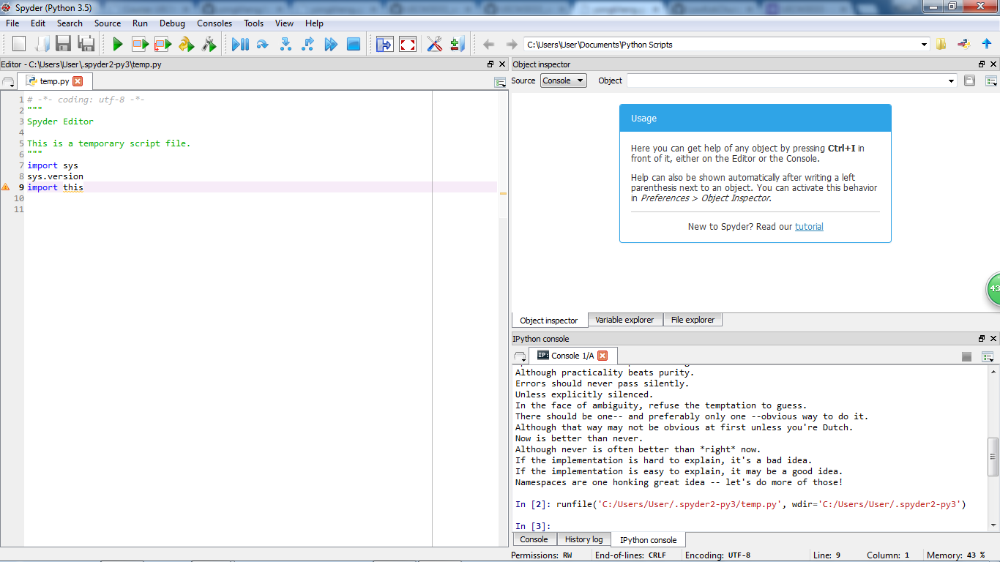

UECM3033 Assignment #1 Report
========================================================

- Prepared by: ** Low Kok Chung**
- Tutorial Group: T2

--------------------------------------------------------

## Task 1 -- setup a github repository

The reports, codes and supporting documents are uploaded to Github at: 

[https://github.com/LowKokChung/UECM3033_assign1](https://github.com/LowKokChung/UECM3033_assign1)

---------------------------------------------------------

## Task 2 -- setup python

Put here the screen shot of file (python.png)

------------------------------------------------------------

## Task 3 -- modify and run Python script

In this section, please report:

1. The hexadecimal value of your student ID.
2. Write down the definite integrals that you have chosen.
3. Write down your system of 10 linear equations.

Solution
1. The hexadecimal value of my student ID, 1206226 = 0x1267d2
2. $$\int_0^{\infty} e^{-2*x^3} dx = 2**(2/3)*gamma(1/3)/6

\begin{align*}
3 x_0 +x_1 + 5 x_2 + 9 x_3 + 8 x_4 + 2 x_5 + 6 x_6 + 7 x_7 + x_8 + 3 x_9&= 21, \\
x_0 + 2 x_1 + 4 x_2 + 7 x_3 + 6 x_4 + 2 x_5 + 4 x_6 + 6 x_7 + 9 x_8 + 3 x_9&= 48, \\
9 x_0 + 7 x_1 + 4 x_2 + 2 x_3 + 5 x_4 + 8 x_5 + 3 x_6 + 5 x_7 + 7 x_8 + 9 x_9&= 33, \\
4 x_0 + 2 x_1 + 6 x_2 + 8 x_3 + 7 x_4 + 4 x_5 + 6 x_6 + 9 x_7 + x_8 + 3 x_9&= 80, \\
2 x_0 + 6 x_1 + 8 x_2 + 4 x_4 + 6 x_5 + 9 x_6 + 3 x_7 + x_8 + 7 x_9&= 76, \\
7 x_0 + 6 x_1 + 4 x_3 + 2 x_4 + 9 x_5 + 4 x_6 + 9 x_7 + 7 x_8 + x_9&= 90, \\
6 x_0 + 9 x_1 + 3 x_3 + x_4 + 5 x_6 + 3 x_7 + 8 x_8 + 4 x_9&= 51, \\
5 x_1 + 8 x_2 + 4 x_3 + 8 x_4 + 3 x_5 + 2 x_6 +x_7 + 6 x_8 + 8 x_9&= 46,\\
7 x_0 + 8 x_2 + 5 x_3 +x_4 + 4 x_5 + 6 x_6 + 8 x_7 + 4 x_9&= 55, \\
2 x_0 + 6 x_1 + 9 x_2 + 5 x_4 + 3 x_5 + 6 x_6 + 8 x_7 + 2 x_8 + 5 x_9&= 79.
\end{align*}

-----------------------------------

last modified: 28.1.2016
